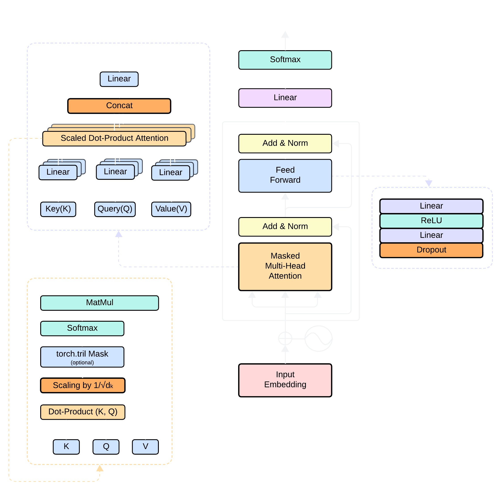

# Building-LLMs-from-Scratch



This repository contains the full implementation of GPT-1 (i.e., a Transformer Decoder) from scratch using PyTorch, inspired by the landmark paper **"Attention is All You Need"**.

## 🧠 What This Project Is About

Demystifying large language models by **pretraining a Transformer Decoder architecture (GPT-1)** from scratch on a clean, public domain dataset — **[Project Gutenberg](https://www.gutenberg.org/)**.

This project serves as an educational and hands-on walkthrough to understand:

- How the GPT architecture works under the hood
- How to train language models using only a decoder block
- How attention mechanisms empower modern LLMs

---

## 📚 Dataset

We use **Project Gutenberg**, a massive open-source corpus of books, for pretraining the language model.

- Text data is cleaned, tokenized, and chunked into fixed-length sequences
- A Byte-Pair Encoding (BPE) tokenizer or simple character-level tokenization is applied (custom or HuggingFace-supported)

---

## 🏗️ What's Implemented

- [x] Tokenizer (BPE-level)
- [x] Positional Encoding
- [x] Multi-Head Self Attention
- [x] Layer Normalization
- [x] Causal Masking (for decoder)
- [x] Transformer Decoder Block
- [x] GPT-style Model (stacked decoder blocks)
- [x] Training loop with cross-entropy loss
- [x] Distributed GPU Training (Lightning Fabric) 
- [x] Checkpoint saving & logging

<!-- ---

## 🚀 Getting Started

```bash
git clone https://github.com/your-username/Building-LLMs-from-Scratch.git
cd Building-LLMs-from-Scratch

# (Optional) Create a virtual environment
python -m venv venv
source venv/bin/activate

pip install -r requirements.txt
```

Then follow the instructions in `train.py` to start training your GPT-1 model.

--- -->

## 🧾 Reference

- [Attention Is All You Need (Vaswani et al., 2017)](https://arxiv.org/abs/1706.03762)
- [OpenAI GPT Paper](https://cdn.openai.com/research-covers/language-unsupervised/language_understanding_paper.pdf)

## 📬 License

MIT License © 2025

